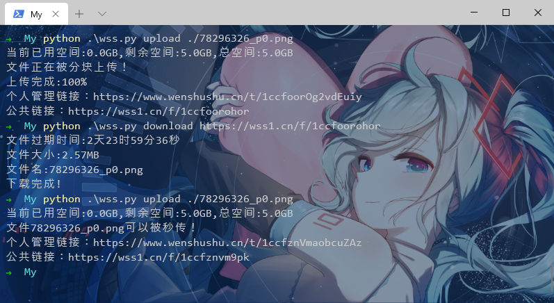

<h1 align="center">- wenshushu （文叔叔） -</h1>
<p align="center"> Python 3.7 </p>
<p align="center"> 多线程上传下载，秒传，使用体验与网页无差别。 </p>
<p align="center"></p>

## 使用教程

#### 1. 安装依赖

```shell
pip install requests base58 pycryptodomex
```

#### 2. 上传

```shell
python wss.py upload xxx.file
```

#### 3. 下载

```shell
python wss.py download https://wss1.cn/f/xxxxxxxxxxx
```

#### 4. 返回

管理链接可以用来销毁文件，分享文件，续期文件。

公共链接只能用于下载。

### 注意事项

1. 在 Windows 下使用时，文件名如果为 " .\xxx" ，那么上传的是一个文件夹，文件夹里面是这个文件，所以如果上传文件的话，路径的斜杠需要为 “ / " 。
2. 由于游客并不能查看自己上传过的文件，所以每次上传均会生成一个新的 **X-TOKEN**。
3. 这个网站也是挺良心的，所以禁止滥用。
